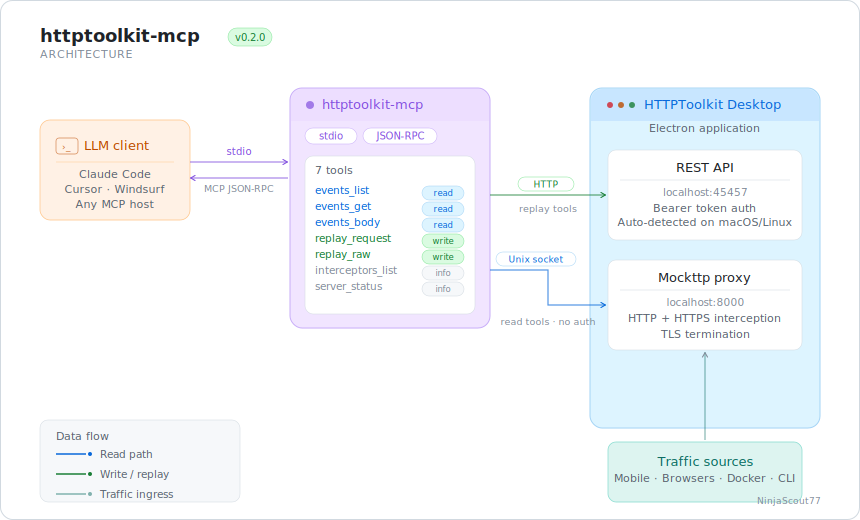

# httptoolkit-mcp

**Drive HTTPToolkit from any MCP-compatible LLM client. Built for security testing on traffic that HTTPToolkit captures — mobile apps, electron apps, browsers, terminals.**

[](https://github.com/NinjaScout77/httptoolkit-mcp/actions)
[](https://www.npmjs.com/package/@ninjascout77/httptoolkit-mcp)
[](LICENSE)

---

<p align="center">
  
</p>

---

## Is this for you?

Read this first. Five minutes here saves the wrong user from installing the wrong tool.

### Use this if

- You're already using HTTPToolkit because of its mobile interception capabilities — one-click Android cert injection, Flutter SSL pinning bypass, per-app interception on rooted devices.
- You're testing Electron apps and want HTTPToolkit's electron interceptor to launch them with the proxy attached.
- You're using HTTPToolkit's terminal interceptor to capture CLI tool traffic (kubectl, aws-cli, language SDKs) and want LLM-driven analysis.
- You want an LLM to do systematic security testing — BOLA enumeration, auth header stripping, body field privilege escalation, SSRF probes, path traversal — on traffic captured by any HTTPToolkit interceptor.
- You want LLM-driven analysis with an audit trail, scope guards, and rate limiting for unattended operation.

### Don't use this if

- You're testing a regular web app or API and have Burp Suite Professional. Burp's Repeater, Intruder, and Scanner are unmatched for web work, and PortSwigger's [official Burp MCP](https://github.com/PortSwigger/mcp-server) gives the LLM access to all of it. That's the right tool for that job.
- You don't have HTTPToolkit installed and don't want to install it. We assume HTTPToolkit is your proxy — we don't replace it.

### "But I want both Burp and HTTPToolkit"

Common and reasonable. See [§ Burp Suite integration](#burp-suite-integration). Short version: HTTPToolkit handles device-side capture (where it's better), Burp handles tester-side analysis (where it's better), our MCP routes through both.

---

## What this does

Seven tools across three categories, all working today on macOS and Linux.

**Read tools** — work zero-config the moment HTTPToolkit's desktop app is running. No auth token. No setup.
- `events_list` — list captured traffic with filtering (HTTPToolkit's native filter syntax: `hostname=...`, `method=POST`, `status>=400`)
- `events_get` — full headers, status, timing for one event
- `events_body` — request or response body with offset/length, automatic binary detection (returns base64 for non-text content)

**Server tools** — also zero-config.
- `server_status` — proxy port, cert path, version, replay availability
- `interceptors_list` — what HTTPToolkit can intercept on this machine

**Replay tools** — fire mutated requests through HTTPToolkit's send pipeline. Token is auto-discovered from the running HTTPToolkit process on macOS and Linux.
- `replay_request` — fetch a captured event by ID, apply mutations (header swaps, body field flips, path/query changes), fire through HTTPToolkit. Replays go to the target and the response comes back to the LLM.
- `replay_raw` — fire an arbitrary request from scratch (Burp Repeater equivalent).

### What it doesn't have, by design

- No autonomous "find vulnerabilities" tool. The LLM is the agent; we're the toolkit. We provide sharp primitives, the LLM composes them.
- No interceptor wrappers for every interceptor type. Use HTTPToolkit's UI to start interception, or call `interceptors_list` and the underlying activation. We don't add a tool per browser/runtime.
- No HTTPToolkit replacement. We talk to HTTPToolkit; we don't reimplement what it does.

### What's coming

Live capture subscription, findings tracking with Markdown/JSON export, batch replay, and Windows replay support are planned for `1.0.0`.

---

## Quick start

Three steps, total time about two minutes.

### 1. Install HTTPToolkit

Download from [httptoolkit.com](https://httptoolkit.com). Free tier works for read tools. Pro tier is required for replay (HTTPToolkit's policy — see [§ Tier requirements](#tier-requirements)).

### 2. Install httptoolkit-mcp

```bash
npm install -g @ninjascout77/httptoolkit-mcp
```

Or run directly without installing:

```bash
npx -y @ninjascout77/httptoolkit-mcp
```

### 3. Register with your LLM client

#### Claude Code

```bash
claude mcp add httptoolkit --scope user -- npx -y @ninjascout77/httptoolkit-mcp
```

Verify:

```bash
claude mcp list
```

`httptoolkit: ✓ Connected` should appear.

#### Claude Desktop

Edit `~/Library/Application Support/Claude/claude_desktop_config.json` (macOS) or `%APPDATA%\Claude\claude_desktop_config.json` (Windows):

```json
{
  "mcpServers": {
    "httptoolkit": {
      "command": "npx",
      "args": ["-y", "@ninjascout77/httptoolkit-mcp"]
    }
  }
}
```

If `npx` isn't in PATH for GUI apps (common on macOS), use the absolute path:

```json
{
  "mcpServers": {
    "httptoolkit": {
      "command": "/opt/homebrew/bin/node",
      "args": ["/path/to/httptoolkit-mcp/dist/index.js"]
    }
  }
}
```

Fully quit and reopen Claude Desktop. The connector should appear in settings.

### 4. First query — verify it works

In your LLM client:

> Use the httptoolkit MCP. Call server_status and show me only the fields the tool returned. Do not interpret.

You should see proxy port, cert path, and `replayAvailable: true` (if HTTPToolkit is running and you have Pro). If `replayAvailable: false`, you don't have Pro or auto-detection couldn't find the running server — see [§ Troubleshooting](#troubleshooting).

---

## Try it — example prompts

These prompts work as written. Copy them into Claude Code or Claude Desktop with the MCP connected and HTTPToolkit running. Capture some traffic first by using your target app for a minute, then run.

### 1. Survey the captured surface

> Use the httptoolkit MCP. List the most recent 50 captured events. Group them by hostname and tell me which hostnames appear most often. Show only what the tools returned.

What this does: maps the API surface of whatever app you're proxying. First step in any engagement.

### 2. Find unauthenticated endpoints

> Use the httptoolkit MCP. List events from the last 200 captures. For each unique endpoint (method + path), tell me whether at least one capture had an Authorization header. Highlight endpoints where no captures had auth.

What this does: identifies endpoints that may be reachable without authentication. Common starting point for finding broken access control.

### 3. Test for IDOR / BOLA on a captured request

> Use the httptoolkit MCP. Find a captured request whose path looks like `/users/<id>`, `/accounts/<id>`, or similar. Use replay_request to fire it 5 times with the user ID in the path replaced by 5 different values (try sequential IDs near the original). Compare response status and body sizes — flag any that returned 200 with a non-empty body suggesting cross-tenant data access.

What this does: checks whether the endpoint validates that the requesting user owns the resource being requested. The mutation engine handles the path substitution; the LLM compares responses.

### 4. Auth bypass test

> Use the httptoolkit MCP. Pick a captured request that has an Authorization header and returned 200. Use replay_request to fire it twice — once unmodified, once with `mutations: {"headers.Authorization": ""}`. If the second one also returns 200 with similar body, that's an authentication bypass candidate.

What this does: tests whether the endpoint actually enforces the auth header it sends. Many endpoints accept credentials but don't validate them.

### 5. Privilege escalation via body field

> Use the httptoolkit MCP. Find a captured POST with a JSON body containing fields like `is_admin`, `role`, `user_id`, `permissions`, or similar. Use replay_request to fire it twice — once unmodified, once with the suspected privilege field flipped (e.g., `mutations: {"body.is_admin": true}`). Compare responses and tell me whether the server accepted the modified field.

What this does: tests for mass-assignment vulnerabilities where the API trusts client-supplied fields it shouldn't.

### 6. Scope-aware exploration

> Use the httptoolkit MCP. List events filtered to only `api.example.com`. For each unique endpoint, tell me what HTTP method it accepts, whether it returns JSON, and whether the response includes any obvious sensitive fields like email addresses, internal IDs, or tokens.

What this does: focused analysis on a single host. Useful when proxying multiple services and you want to focus on one.

---

## Authentication and replay

The MCP uses two communication channels with HTTPToolkit:

1. **Unix socket** (no auth needed) — used for read tools and server status
2. **HTTP API on port 45457** (token required) — used for replay tools

**Read tools work immediately** as long as HTTPToolkit's desktop app is running.

**Replay tools require the HTTPToolkit session token.** Starting in `0.2.0`, the MCP automatically discovers this token from the running HTTPToolkit process on macOS and Linux:

- macOS: via `sysctl(KERN_PROCARGS2)` (uses bundled native binary)
- Linux: via `/proc/<pid>/environ`

This means **replay just works when HTTPToolkit is running** — no manual token configuration.

### When auto-detection won't work

- **HTTPToolkit isn't running** → start the desktop app and retry.
- **HTTPToolkit Free tier** → `/client/send` is a Pro feature. Replay calls return tier-required errors. Read tools continue to work.
- **Windows** → not yet supported for auto-detection. Set `HTK_SERVER_TOKEN` manually if you've obtained it through other means.
- **Linux ARM64** → not yet supported for auto-detection (no prebuilt binary). Set `HTK_SERVER_TOKEN` manually or use x86 Linux.

### Manual token override

For environments where auto-detection doesn't work, set the env var explicitly:

```json
{
  "mcpServers": {
    "httptoolkit": {
      "command": "npx",
      "args": ["-y", "@ninjascout77/httptoolkit-mcp"],
      "env": {
        "HTK_SERVER_TOKEN": "your-token-value"
      }
    }
  }
}
```

The explicit env var takes priority over auto-detection.

### Where replays appear in HTTPToolkit's UI

This trips up new users — worth being explicit:

- Replays fired by `replay_request` and `replay_raw` do **not** appear in HTTPToolkit's View tab (which shows organic intercepted traffic only).
- Replays do **not** create entries in HTTPToolkit's Send tab (which is reserved for UI-initiated requests).
- Replays **are** recorded in `~/.httptoolkit-mcp/audit.jsonl` with timestamp, target, response status, mutations, and description. **This is your ground truth.**
- The full response is returned directly to the LLM via the tool result.

This is HTTPToolkit's architectural choice — `/client/send` calls via REST API bypass the proxy capture path. The audit log is the canonical record.

---

## Tier requirements

| Tool | Free tier | Pro tier |
|---|---|---|
| `events_list`, `events_get`, `events_body` | ✓ | ✓ |
| `server_status`, `interceptors_list` | ✓ | ✓ |
| `replay_request`, `replay_raw` | Tier-required error returned | ✓ |

Tier enforcement is HTTPToolkit's policy, not ours. We pass their errors through with clear upgrade messages.

[Get HTTPToolkit Pro →](https://httptoolkit.com/get-pro)

---

## Burp Suite integration

The honest answer to *"why use both"* — they're good at different things.

### What each tool is best at

**HTTPToolkit excels at device-side interception.** One-click Android cert injection on rooted devices. Built-in Flutter SSL pinning bypass via Frida. Per-app interception that doesn't affect other device traffic. Electron apps launched with proxy attached. Terminal sessions with HTTP_PROXY pre-configured. iOS interception via Frida.

**Burp Suite excels at tester-side analysis.** Repeater for manual request iteration. Intruder for fuzzing and enumeration. Scanner for automated vulnerability detection. Decades of plugins and integrations.

For mobile and electron pentesting where Burp's interception path is painful, HTTPToolkit-on-device + Burp-as-upstream is genuinely the best of both worlds.

### The chain

```
Mobile/desktop client → HTTPToolkit → Burp → target
```

HTTPToolkit handles device-side complexity. Burp captures everything HTTPToolkit forwards. Both UIs show the same traffic. Our MCP can do LLM-driven analysis on captured traffic and fire mutated replays — they appear in both HTK and Burp. Manual testing happens in Burp's Repeater on the candidates the LLM identified.

### Configuration

In HTTPToolkit: Settings → Connection → Upstream proxy → `http://127.0.0.1:8080` (or wherever Burp listens).

In httptoolkit-mcp environment:

```bash
export BURP_UPSTREAM=http://127.0.0.1:8080
```

When set, replays through our MCP route via Burp upstream. The MCP TCP-probes Burp on startup and warns if it's unreachable.

---

## Configuration

All optional. Set in environment when launching the MCP.

| Variable | Default | Purpose |
|---|---|---|
| `HTK_SERVER_TOKEN` | unset (auto-detected) | Auth token for HTTPToolkit's HTTP API. Required for replay tools. Auto-discovered on macOS/Linux when HTTPToolkit is running. Explicit override always wins. |
| `HTK_SERVER_HOST` | `127.0.0.1` | HTTPToolkit host |
| `HTK_API_PORT` | `45457` | HTTPToolkit REST API port |
| `BURP_UPSTREAM` | unset | Upstream proxy URL for replay routing |
| `REPLAY_ALLOWLIST` | unset (permissive + warns) | Comma-separated host patterns. Wildcards supported (`*.example.com`). |
| `REPLAY_RATE_LIMIT_RPS` | `10` | Per-host replay rate limit |
| `AUDIT_LOG_PATH` | `~/.httptoolkit-mcp/audit.jsonl` | Forensic trail location |
| `LOG_LEVEL` | `info` | `debug`, `info`, `warn`, `error` |

---

## Safety

This MCP can fire real HTTP requests at real targets. Three safeguards built in.

### Scope allowlist

Set `REPLAY_ALLOWLIST=api.example.com,*.test.local` and replays to other hosts return a structured error. Catches the LLM accidentally hitting the wrong target.

If unset, replays go through but each one logs a warning. **Strongly recommended for production engagements.**

### Rate limiting

Per-target-host token bucket. Default 10 requests per second. Stops the LLM from accidentally DoS-ing a target while iterating mutations.

### Audit log

Every replay appends to `~/.httptoolkit-mcp/audit.jsonl`:

```json
{"timestamp":"2026-04-28T19:23:11Z","replay_id":"...","source_event_id":"...","mutations":{"headers.Authorization":""},"target_url":"https://...","response_status":200,"description":"BOLA test 1 of 5"}
```

Append-only. Auto-rotates at 100MB. Survives across sessions. Use this as evidence for your test report.

---

## Working with LLM clients

The MCP returns structured tool results to whatever LLM client you've connected. Some practical notes about LLM behavior that affect security work specifically.

### LLM memory and tool results

LLM clients like Claude Desktop maintain persistent conversation memory across sessions. When you call an MCP tool, the LLM has two relevant context sources: the actual tool result, and whatever it remembers from prior conversations. Default LLM behavior is to combine them into a "helpful" response — which can mean stating memory-derived claims with the same authority as tool-anchored facts.

Concrete example: ask `server_status` and the LLM may add commentary like *"and your previous engagement chain was X"* — where the engagement detail came from memory, not from the tool.

This matters for security testing where you need clean separation between *what the data shows* and *what the LLM remembers*. Two patterns help.

#### Pattern 1 — Constrain to tool output only

For factual MCP queries where you want only what the tool returned:

> Call the `<tool_name>` tool from the httptoolkit MCP connector. Show me only the fields the tool actually returned. Do not interpret, do not connect to other context, do not infer.

#### Pattern 2 — Demand provenance

For analytical queries where you want the LLM's reasoning but need to separate it from raw data:

> Use the MCP tools as needed. For each statement in your response, indicate whether it came from a tool result (label `[from MCP]`) or from your memory or inference (label `[from memory]` or `[inference]`).

### LLMs may hallucinate setup steps

When you ask an LLM how to configure or unblock a tool, it may invent file paths, environment variable names, or configuration steps that sound plausible but don't exist on your system.

A real example: when an LLM was asked how to enable replay tools in `httptoolkit-mcp`, it suggested reading the token from `~/Library/Preferences/httptoolkit/auth-token`. That file does not exist — HTTPToolkit holds the token only in process memory and never writes it to disk. The LLM produced a confident, well-formatted answer that would have wasted setup time.

How to defend:

- Verify any file path the LLM mentions before reading or writing to it (`ls` it first).
- Verify any command the LLM tells you to run by checking the binary exists (`which <command>`).
- When the LLM gives setup advice, ask: *"Can you point me to where this is documented?"* — forces the LLM to either cite a real source or admit it doesn't know.
- For security tools, prefer the project's README and CHANGELOG over LLM-generated setup instructions.

### Recommendations

- For client engagements where data segregation matters, run security testing in a dedicated LLM session with memory disabled, or in a fresh conversation.
- Be explicit about which MCP connector to use when calling tools (e.g., *"from the httptoolkit MCP connector"*) — this avoids ambiguity if you have multiple MCPs configured.
- Treat LLM responses as analyst notes, not findings. Cross-reference any actionable claim against the underlying tool output before acting on it.
- The HTK_SERVER_TOKEN is not cryptographically secret — it's a local-only authenticator. Your user account is the security boundary.

---

## Troubleshooting

### `replayAvailable: false` even though HTTPToolkit is running

**Possible causes:**

1. **You're on HTTPToolkit Free.** Replay requires Pro. Read tools still work.
2. **Auto-detection couldn't find the running httptoolkit-server process.** Check that HTTPToolkit's desktop app is fully launched (not just the splash screen). Restart HTTPToolkit and retry.
3. **You're on Windows or Linux ARM64.** Auto-detection isn't supported on these platforms yet. Set `HTK_SERVER_TOKEN` manually if you've obtained the token through other means.

### "Cannot connect to HTTPToolkit via socket at /tmp/..." on macOS

**Cause:** Some LLM clients launch MCP child processes with sanitized environments that don't propagate `$TMPDIR`. Verified behavior:

- **Claude Desktop:** strips `$TMPDIR` (affected pre-0.2.0)
- **Claude Code (CLI):** propagates `$TMPDIR` correctly (not affected)

**Fix:** Upgrade to `0.2.0` or later — uses `getconf DARWIN_USER_TEMP_DIR` directly, no env var dependency.

### MCP not appearing in Claude Desktop's connectors list

**Common causes:**

1. JSON syntax error in `claude_desktop_config.json`. Validate: `cat ~/Library/Application\ Support/Claude/claude_desktop_config.json | python3 -m json.tool`
2. Wrong path to `node` or `dist/index.js`. Confirm with `which node` and `ls /path/to/dist/index.js`.
3. The MCP crashed on startup. Check the log: `tail -50 ~/Library/Logs/Claude/mcp-server-httptoolkit.log`

### `HTTPTOOLKIT_NOT_RUNNING` error

The MCP detected that no `httptoolkit-server` process is running. Start HTTPToolkit's desktop app and retry. If HTTPToolkit IS running and you still see this, check `pgrep -lf httptoolkit-server` to confirm the process is visible to your shell.

### Replays don't show in HTTPToolkit's View tab

This is by design. See [§ Where replays appear](#where-replays-appear-in-httptoolkits-ui). Check `~/.httptoolkit-mcp/audit.jsonl` to confirm replays actually fired.

---

## Known limitations

Stated honestly:

- **Token auto-detection requires native code** — uses `sysctl` on macOS and `/proc` on Linux. Prebuilt binaries ship for `darwin-x64`, `darwin-arm64`, `linux-x64`. Other platforms (Windows, Linux ARM64) need manual `HTK_SERVER_TOKEN`.
- **Live capture subscription** is `1.0.0` (Phase 2), not in current version. Read tools list events HTTPToolkit has already captured. Real-time streaming comes later.
- **Findings tracking, batch replay** — also `1.0.0` (Phase 2).
- **Tier check on `/client/send`** may block replays for HTTPToolkit Free users. We don't enforce this; HTTPToolkit does.

---

## Documentation

- [CHANGELOG.md](./CHANGELOG.md) — version history

---

## Contributing

Issues and PRs welcome. Open an issue first for substantial changes so we can align on direction.

For security concerns: please email the maintainer before opening a public issue.

---

## Credits

Built by Pradeep Suvarna ([NinjaScout77](https://github.com/NinjaScout77)).

Thanks to:
- [Tim Perry](https://github.com/pimterry) for HTTPToolkit, which makes mobile interception genuinely tractable
- [PortSwigger](https://github.com/PortSwigger) for setting the bar with their Burp MCP architecture

---

## License

MIT — see [LICENSE](./LICENSE)
